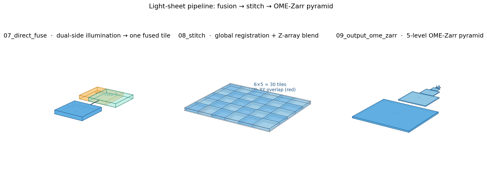

# Light Sheet Fusion → Stitch → OME-Zarr Pipeline

Python/SLURM pipeline for Zeiss CZI light sheet data.



```
07_direct_fuse   →   08_stitch   →   09_output_ome_zarr   →   10_export_ome_tiff (optional)
   (fusion)         (registration         (multi-resolution         (Imaris / Fiji
                     + blending)           OME-Zarr pyramid)         compatibility)
```

The figure above shows each stage on a real KL018-sized 6×5 tile grid:
dual-side illumination merged into one fused tile (left), the 30-tile
mosaic with ~15% XY overlap (centre, overlap zone in red), and the
5-level OME-Zarr pyramid (right). Source: `docs/render_pipeline_3d.py`.

## Submit order

```bash
# Step 1: direct CZI → fused zarr (reads CZI directly; dual-side fusion + NCC refinement)
sbatch 07_direct_fuse.sh

# Step 2: globally-optimised registration + blended stitching
#   Stage 1 (register) and Stage 2 (8-task array blend) are dependency-chained.
JOB1=$(sbatch --parsable 08_stitch_stage1_register.sh)
sbatch --dependency=afterok:$JOB1 08_stitch_stage2_blend.sh

# Step 3: build the OME-Zarr pyramid (PRIMARY output)
sbatch 09_output_ome_zarr.sh

# Step 4 (optional): convert pyramid to OME-TIFF + rsync to stornext
sbatch 10_export_ome_tiff.sh
```

## Working directories

All intermediate state lives under `/vast/scratch/users/kriel.j/KL018_lightsheet/`:

| Path | Produced by | Contents |
|------|-------------|----------|
| `fused_direct.zarr` | `07_direct_fuse` and overwritten by `08_stitch_stage1` | Pre-allocated stitched canvas, written into by Stage 2 |
| `stitch_positions.json` | `08_stitch_stage1_register` | Globally-optimised per-tile transforms (correction only) |
| `stitch_diagnostics.json` | `08_stitch_stage1_register` | Pairwise quality + groupwise convergence stats |
| `czi_layout_cache.json` | first invocation of `08_stitch.py` | CZI mosaic bbox cache (authoritative canvas) |
| `fused_pyramid.ome.zarr` | `09_output_ome_zarr` | Multi-resolution OME-Zarr (5 levels) — **primary deliverable** |
| `KL018_…-Fused-Stitched.ome.tiff` | `10_export_ome_tiff` | OME-TIFF (BigTIFF, LZW) for Imaris / Fiji |

## Preflight (recommended before a full-stack rerun)

Before submitting `08_stitch_stage1_register.sh` for the full 1557-plane volume,
run the preflight pair on a 100-plane substack to catch algorithmic regressions
in ~1h instead of burning ~10 GPU-hours on a bad full run:

```bash
JOB1=$(sbatch --parsable 08_stitch_preflight_stage1.sh)
sbatch --dependency=afterok:$JOB1 08_stitch_preflight_stage2.sh
```

The preflight scripts write to `KL018_lightsheet/preflight/` and produce
`substack_z728_828_stitched.zarr` for side-by-side inspection in
`08_fusion_dev.ipynb`. The production zarr is left untouched.

## Environment

```bash
conda env create -f environment_mvstitch.yml -p /vast/scratch/users/kriel.j/mvstitch_env
```

This env hosts multiview-stitcher 0.1.52 + dask 2025.10.0 for Steps 07 and 08.
Step 09 / 10 use `/vast/projects/BCRL_Multi_Omics/spatialdata_env_2` (zarr + tifffile).

## Operational notes

- All scripts set `export PYTHONUNBUFFERED=1`. SLURM logs stream live — silence
  means the job hung, not that python is buffering.
- `08_stitch_stage1_register.sh` includes an inline gate check (converged +
  median pairwise quality > 0.2 + max residual < 5 px + n_pairs ≥ 40). The
  zarr is not recreated and Stage 2 will not run if the gate fails.
- `08_stitch_stage2_blend.sh` is a SLURM array (1-8) over chunk-aligned Z
  partitions. Tasks write disjoint Z-slabs into the shared zarr in `r+` mode.
- Monitor logs: `/vast/scratch/users/kriel.j/output.<jobid>.<node>.log`
  (Stage 2 array tasks use `output.<per-task-jobid>.<array-idx>.<node>.log`).

## Legacy scripts (not in this repo)

An older 01–06 pipeline (extract → convert → deskew → fuse → 05_stitch → 06_output)
exists locally for reference but is no longer maintained — `07_direct_fuse`
reads CZI directly and supersedes 01–04, and `08_stitch` replaces the
ImgLib2-based `05_stitch`. The legacy scripts are intentionally untracked.
